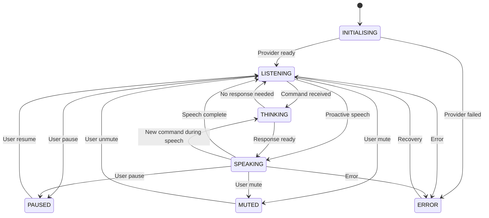

# State Yönetimi

## State Türleri

### Global State (JarvisLive)

Tüm uygulamayı ilgilendiren durumlar:

| State | Açıklama | Geçerli Geçişler |
|-------|----------|------------------|
| `INITIALISING` | Başlangıç, provider bağlanıyor | → LISTENING, → ERROR |
| `LISTENING` | Mikrofon açık, komut bekliyor | → THINKING, → SPEAKING, → ERROR, → PAUSED, → MUTED |
| `THINKING` | LLM/skill işlem yapıyor | → SPEAKING, → LISTENING, → ERROR |
| `SPEAKING` | JARVIS yanıt veriyor | → LISTENING, → THINKING, → ERROR, → PAUSED, → MUTED |
| `ERROR` | Bir hata oluştu | → LISTENING |
| `PAUSED` | Tüm işlemler durduruldu | → LISTENING |
| `MUTED` | Ses çıkışı kapalı | → LISTENING |

```python
# main.py — State machine validasyonu
_VALID_TRANSITIONS = {
    "INITIALISING":  {"LISTENING", "ERROR"},
    "LISTENING":     {"THINKING", "SPEAKING", "ERROR", "PAUSED", "MUTED"},
    "THINKING":      {"SPEAKING", "LISTENING", "ERROR"},
    "SPEAKING":      {"LISTENING", "THINKING", "ERROR", "PAUSED", "MUTED"},
    "ERROR":         {"LISTENING"},
    "PAUSED":        {"LISTENING"},
    "MUTED":         {"LISTENING"},
}

def set_state(self, new_state: str):
    """Thread-safe state güncelleme + validasyon."""
    with self._speaking_lock:
        old = self._state
        if new_state not in _VALID_TRANSITIONS.get(old, set()):
            self.write_debug(f"Uyari: Gecersiz state gecisi {old} → {new_state}")
            return
        self._state = new_state
    
    # UI güncelle
    if self._ui:
        self._ui.set_state(new_state)
```

### Session State (Provider'a özel)

Her provider (Gemini/Ollama) kendi session state'ini yönetir:

| Provider | State | Açıklama |
|----------|-------|----------|
| Gemini | `_session` | Live API session (None / active / reconnecting) |
| Gemini | `_audio_queue` | asyncio.Queue (maxsize=10, ses buffer) |
| Gemini | `_tasks` | TaskGroup (4 coroutine) |
| Ollama | `_history` | Son N mesaj (list[dict]) |
| Ollama | `_running` | bool — loop durumu |
| Ollama | `_stt_thread` | PyAudio background thread |

### Agent State (ACA)

```python
# core/agent/agent_manager.py
class GoalStatus(str, Enum):
    PENDING = "pending"
    IN_PROGRESS = "in_progress"
    COMPLETED = "completed"
    FAILED = "failed"
    CANCELLED = "cancelled"

@dataclass
class AgentGoal:
    goal_id: str
    text: str
    status: GoalStatus = GoalStatus.PENDING
    created_at: float = 0.0
    started_at: float | None = None
    completed_at: float | None = None
    result: str = ""
    total_steps: int = 0
    completed_steps: int = 0
    failed_steps: int = 0
```

### Conversation State (Konuşma Geçmişi)

- **Gemini modu:** Session tarafında yönetilir (Google AI)
- **Ollama modu:** `self._history` listesi (sliding window, son N mesaj)
- **Bellek:** `memory/memory_manager.py` (JSON dosya, kalıcı)

```python
# memory/memory_manager.py — Kalıcı konuşma belleği
def update_memory(updates: dict) -> None:
    """Belleği güncelle ve JSON'a yaz."""
    memory = load_memory()
    _deep_merge(memory, updates)
    _write_memory(memory)

def format_memory_for_prompt() -> str:
    """Belleği system prompt'a eklenebilir formata çevir."""
    memory = load_memory()
    parts = []
    for category in ["identity", "preferences", "projects", "notes"]:
        data = memory.get(category, {})
        if data:
            parts.append(f"[{category.upper()}]")
            for k, v in data.items():
                parts.append(f"  {k}: {v}")
    return "\n".join(parts)
```

## State Storage

| State Türü | Depolama | Konum | Kalıcılık |
|------------|----------|-------|-----------|
| Global state (JarvisLive) | In-memory | `self._state` (string) | Yok |
| Session state | In-memory | Provider instance | Yok |
| Agent state (ACA) | In-memory | `AgentManager._goals` | Yok |
| Konuşma geçmişi | In-memory + Ollama cache | `self._history` | Yok |
| Kullanıcı belleği | JSON dosya | `memory/*.json` | ✅ Kalıcı |
| Zamanlanmış görevler | SQLite | `actions/system_cron.db` | ✅ Kalıcı |
| Süreç zaman çizelgesi | SQLite | `actions/process_timeline.db` | ✅ Kalıcı |
| Disk tahmini | SQLite | `actions/disk_predictor.db` | ✅ Kalıcı |
| API anahtarları | JSON dosya | `config/api_keys.json` | ✅ Kalıcı |

## State Persistence

### Uygulama Kapanınca

| Ne olur? | Açıklama |
|----------|----------|
| Global state kaybolur | Bir sonraki açılışta INITIALISING |
| Session state kaybolur | Provider yeniden başlar |
| Agent goal state kaybolur | ACA sıfırlanır |
| Kullanıcı belleği kalır | memory/*.json'da saklanır |
| Cron görevleri kalır | SQLite DB'de saklanır |

### Uygulama Açılınca

```python
def run(self):
    self._state = "INITIALISING"
    
    # Config yükle
    config = load_app_config()
    
    # Provider seç
    if config.get("backend_type") == "gemini" and has_gemini_api_key():
        self._create_gemini_provider()
    else:
        self._create_ollama_provider()
    
    # Arka plan servisleri başlat
    start_cron_daemon()         # SQLite'dan cron görevlerini yükle
    FileWatcher(paths, self._ui)  # Dosya izleme başlat
    ProcessTimeline().poll()    # Süreç zaman çizelgesi başlat
```

## State Transitions Diagram



## Race Condition & Concurrency

### Thread-safe State Erişimi

```python
# main.py — Lock ile korunan state
self._speaking_lock = threading.Lock()

def set_speaking(self, speaking: bool):
    """Thread-safe konuşma durumu."""
    with self._speaking_lock:
        self._is_speaking = speaking
        if speaking:
            self.set_state("SPEAKING")
        else:
            self.set_state("LISTENING")

def is_speaking(self) -> bool:
    with self._speaking_lock:
        return self._is_speaking
```

### Kilit Kullanan Modüller

| Modül | Korumalı Alan | Kilit Türü |
|-------|--------------|------------|
| `main.py` | `_is_speaking` | `Lock` |
| `core/skill_manager.py` | Skills listesi, watcher | `RLock` |
| `ui/sound_manager.py` | Ses process listesi | `RLock` |
| `actions/watchdog/file_watcher.py` | Debounce timer, history | `Lock` × 2 |
| `actions/system_cron.py` | Network scan | `Lock` (non-blocking) |

### Lock-Free Tasarımlar

- `FahrettinVAD.is_speech()`: Thread-safe (deque append-only)
- `_gui_queue`: `queue.Queue` (thread-safe built-in)
- `asyncio.Queue`: Coroutine-safe

```python
# ui.py — Thread-safe UI güncelleme
self._gui_queue = queue.Queue()

def process_gui_queue(self):
    """Ana thread'de kuyruktan mesaj oku."""
    try:
        while True:
            msg = self._gui_queue.get_nowait()
            # UI güncelle (Tkinter ana thread'inde)
            ...
    except queue.Empty:
        pass
    finally:
        self.root.after(50, self.process_gui_queue)
```

[Bkz. ORCHESTRATOR.md](ORCHESTRATOR.md) | [Bkz. AGENTS.md](AGENTS.md) | [Bkz. UI_LAYER.md](UI_LAYER.md)
